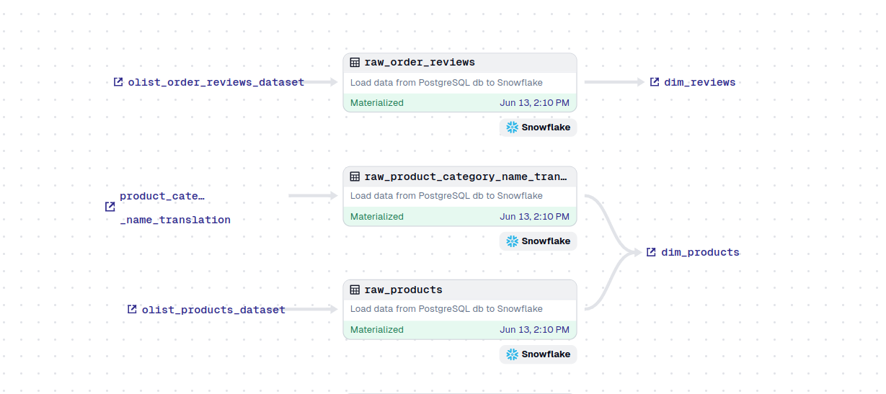
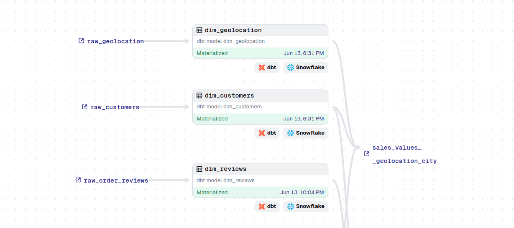
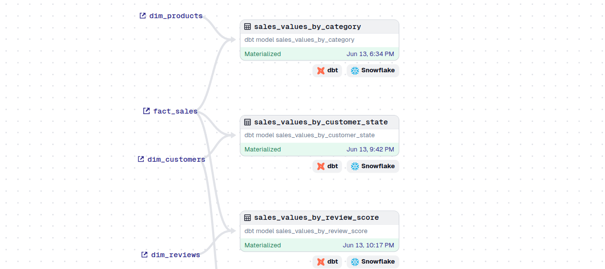

# 🌇 ECommerce-ELT-Pipeline

In this project, I build a simple data pipeline following the ELT(extract - load - transform) model using the Brazilian-Ecommerce dataset, perform data processing and transformation, serve to create reports, in-depth analysis and support for the Data Analyst team

## 📦 Technologies

 - `PostgreSQL`
 - `Polars`
 - `Dbt`
 - `Dagster`
 - `Snowflake`
 - `Docker`
 - `Metabase`
 - `Apache Superset`

## 🔦 About Project

#### 1. Pipeline Design

 - **Data Source**: The project uses the [Brazilian Ecommerce](https://www.kaggle.com/datasets/olistbr/brazilian-ecommerce) public dataset by Olist, downloaded from [kaggle.com](https://www.kaggle.com) in `.csv` format.
    - The 5 csv files are loaded into `PostgreSQL`, considering it a data source.
    - The remaining 4 csv files are extracted directly.
 - **Extract Data**: Data is extracted using `Polars` as a `DataFrame` from a `PostgreSQL` database and `CSV` file.
 - **Load Data**: After extracting data from the above two data sources, we load it into `Snowflake` at `raw` layer from `Polars` `DataFrame`.
 - **Tranform Data**: After loading the data, we perform `transform` with `dbt` on `Snowflake` to create `dimension` and `fact` tables in the `staging` layer and calculate aggregates in the `mart` layer.
 - **Serving**: Data is served for `reporting`, `analysis`, and `decision support` using `Metabase` and `Apache Superset`.
 - **package and orchestrator**: The entire project is packaged and orchestrated by `Docker` and `Dagster`.

#### 2. Data File Relationships

 - **olist_geolocation_dataset**: This dataset has information Brazilian zip codes and its lat/lng coordinates.
 - **olist_customers_dataset**: This dataset has information about the customer and its location.
 - **olist_order_items_dataset**: This dataset includes data about the items purchased within each order.
 - **olist_order_payments_dataset**: This dataset includes data about the orders payment options.
 - **olist_order_reviews_dataset**: This dataset includes data about the reviews made by the customers.
 - **olist_orders_dataset**: This is the core dataset. From each order you might find all other information.
 - **olist_products_dataset**: This dataset includes data about the products sold by Olist.
 - **olist_sellers_dataset**: This dataset includes data about the sellers that fulfilled orders made at Olist.

#### 3. Data Lineage
###### 1. General

###### 2. Source Layer (Dagster)

###### 3. Raw Layer (Dagster)

###### 4. Staging Layer (Dagster)

###### 5. Mart Layer (Dagster)

## 👩🏽‍🍳 Features

This is what data pipeline can do in this project:
 - d
