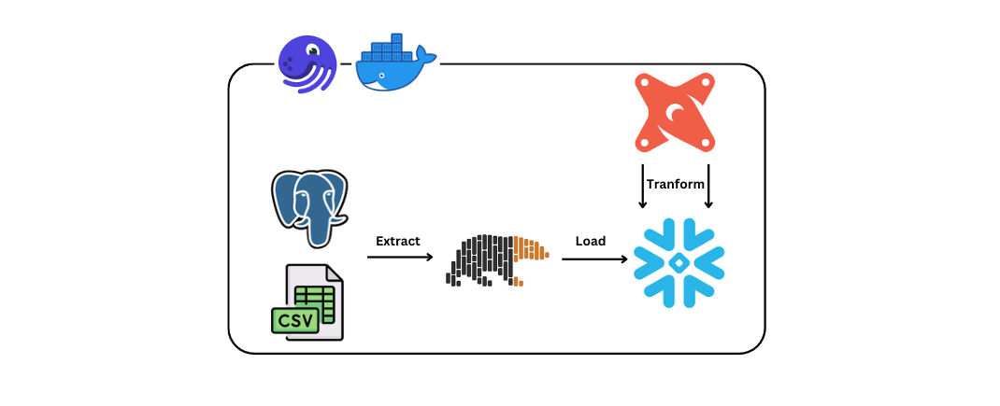
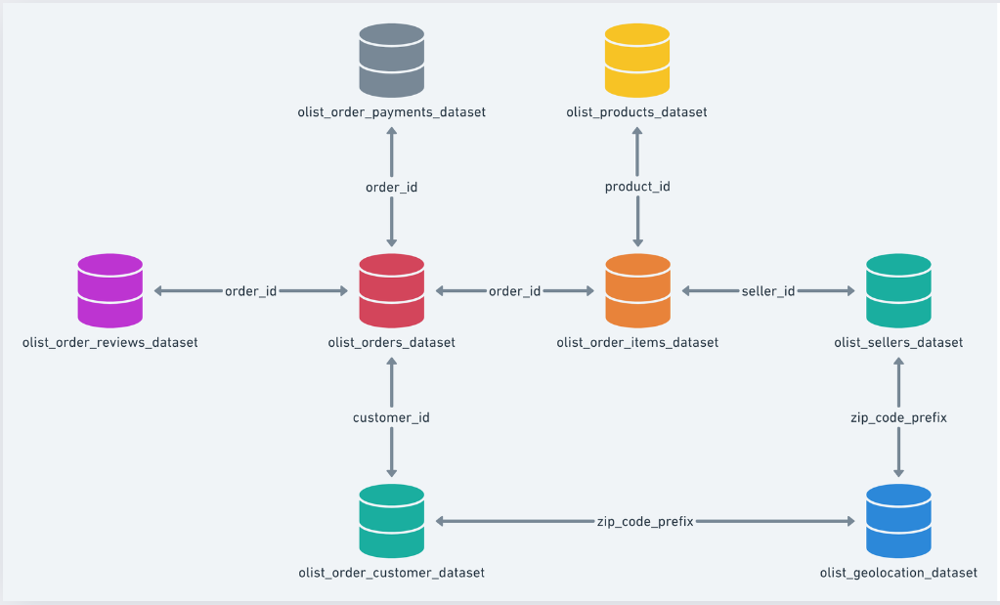
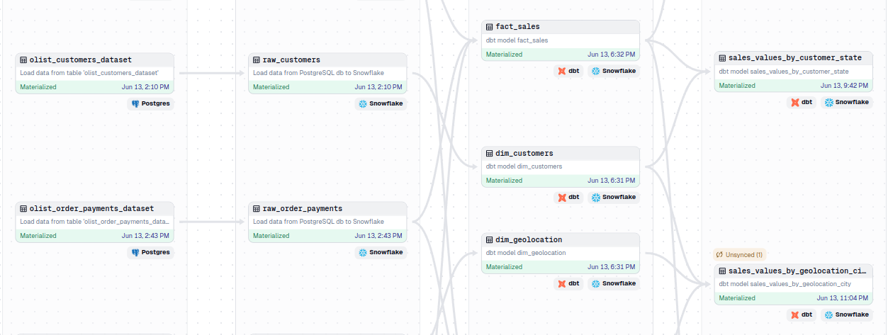

# 🌇 ECommerce-ELT-Pipeline

In this project, I build a simple data pipeline following the ELT(extract - load - transform) model using the Brazilian-Ecommerce dataset, perform data processing and transformation, serve to create reports, in-depth analysis and support for the Data Analyst team

## 📦 Technologies

 - `PostgreSQL`
 - `Polars`
 - `Dbt`
 - `Dagster`
 - `Snowflake`
 - `Docker`
 - `Metabase`
 - `Apache Superset`

## 🔦 About Project

#### 1. Pipeline Design

 - **Data Source**: The project uses the [Brazilian Ecommerce](https://www.kaggle.com/datasets/olistbr/brazilian-ecommerce) public dataset by Olist, downloaded from [kaggle.com](https://www.kaggle.com) in `.csv` format.
    - The 5 csv files are loaded into `PostgreSQL`, considering it a data source.
    - The remaining 4 csv files are extracted directly.
 - **Extract Data**: Data is extracted using `Polars` as a `DataFrame` from a `PostgreSQL` database and `CSV` file.
 - **Load Data**: After extracting data from the above two data sources, we load it into `Snowflake` at `raw` layer from `Polars` `DataFrame`.
 - **Tranform Data**: After loading the data, we perform `transform` with `dbt` on `Snowflake` to create `dimension` and `fact` tables in the `staging` layer and calculate aggregates in the `mart` layer.
 - **Serving**: Data is served for `reporting`, `analysis`, and `decision support` using `Metabase` and `Apache Superset`.
 - **package and orchestrator**: The entire project is packaged and orchestrated by `Docker` and `Dagster`.

#### 2. Data File Relationships

 - **olist_geolocation_dataset**: This dataset has information Brazilian zip codes and its lat/lng coordinates.
 - **olist_customers_dataset**: This dataset has information about the customer and its location.
 - **olist_order_items_dataset**: This dataset includes data about the items purchased within each order.
 - **olist_order_payments_dataset**: This dataset includes data about the orders payment options.
 - **olist_order_reviews_dataset**: This dataset includes data about the reviews made by the customers.
 - **olist_orders_dataset**: This is the core dataset. From each order you might find all other information.
 - **olist_products_dataset**: This dataset includes data about the products sold by Olist.
 - **olist_sellers_dataset**: This dataset includes data about the sellers that fulfilled orders made at Olist.

#### 3. Data Lineage
###### 1. Graph Lineage (DBT)

Graph lineage (dbt) in this project includes models divided into 3 schemas:
 - **raw schema**: contains original data tables, `collected` from different data sources: `PostgrSQL` and `CSV` files.
 - **staging schema**: This is a temporary layer that contains data tables that are `transformed`, `processed`, and `cleaned` before being sent to the `mart` schema.
 - **mart schema**: Contains prepared data tables, optimized for querying, and has some simple aggregate calculations.

###### 2. Graph Lineage (Dagster)

Graph Lineage (dagster) trong dự án này bao gồm 4 layer:
 - **source layer**: This layer contains `assets` that `collect` data from `PostgreSQL` and `CSV` files using `Polars` `DataFrame`.
 - **raw layer**: This layer contains `assets` that perform the task of loading data from `Polars` `DataFrame` into `Snowflake` warehouse in `raw` schema.
 - **staging layer**: This layer contains assets that handle data transformation from the `raw` schema, then the data is put into the `staging` schema.
 - **mart layer**: This layer contains `assets` that are responsible for synthesizing calculations from data in the `staging` schema and then putting the data into the `mart` schema.

## 🦄 Features

Here's what you can do with NinjaSketch:
 - You can completely change the logic or create new `assets` in the `data pipeline` as you wish, perform `aggregate` `calculations` on the `assets` in the `pipeline` according to your purposes.
 - You can also create new `data charts` as well as change existing `charts` as you like with extremely diverse `chart types` on `Metabase` and `Apache Superset`.
 - You can also create new or change my existing `dashboards` as you like

## 💭 How can it be improved?

 - Add more `data sources` to increase data richness.
 - Refer to other `data warehouses` besides `Snowflake` such as `Amazon Redshift` or `Google Bigquery`.
 - Perform more `cleaning` and `optimization` `processing` of the data.
 - Perform more advanced `statistics`, `analysis` and `calculations`.
 - Check out other popular and popular `data orchestration` tools like `Apache Airflow`.
 - Separate `dbt` into a separate service (separate `container`) in `docker` when the project expands
 - Learn about `dbt packages` like `dbt-labs/dbt_utils` to help make the `transformation` process faster and more optimal.

## 🚦 Running the Project

###### To run the project in your local environment, follow these steps: