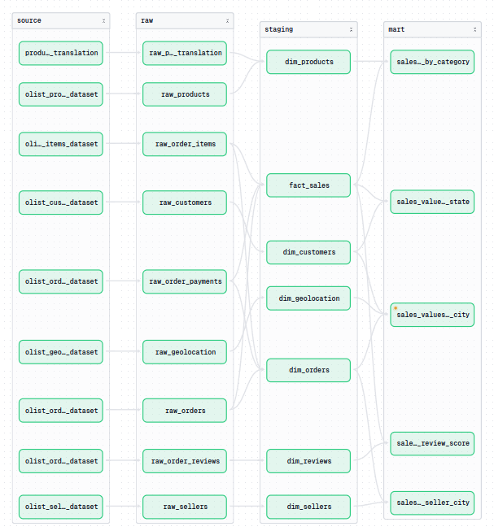

# 🌇 ECommerce-ELT-Pipeline

In this project, I build a simple data pipeline following the ELT(extract - load - transform) model using the Brazilian-Ecommerce dataset, perform data processing and transformation, serve to create reports, in-depth analysis and support for the Data Analyst team

## 📦 Technologies

 - `PostgreSQL`
 - `Polars`
 - `Dbt`
 - `Dagster`
 - `Snowflake`
 - `Docker`
 - `Metabase`
 - `Apache Superset`

## 🔦 About Project

#### 1. Pipeline Design

 - **Data Source**: The project uses the [Brazilian Ecommerce](https://www.kaggle.com/datasets/olistbr/brazilian-ecommerce) public dataset by Olist, downloaded from [kaggle.com](https://www.kaggle.com) in `.csv` format
    - The 5 csv files are loaded into `PostgreSQL`, considering it a data source
    - The remaining 4 csv files are extracted directly
 - **Extract Data**: Data is extracted using `Polars` as a `DataFrame` from a `PostgreSQL` database and `CSV` file
 - **Load Data**: After extracting data from the above two data sources, we load it into `Snowflake` at `raw` layer
 - **Tranform Data**: After loading the data, we perform `transform` with `dbt` on `Snowflake` to create `dimension` and `fact` tables in the `staging` layer and calculate aggregates in the `mart` layer.
 - **Serving**: Data is served for `reporting`, `analysis`, and `decision support`
 - **package and orchestrator**: The entire project is packaged and orchestrated by `Docker` and `Dagster`.

## 👩🏽‍🍳 Features

This is what data pipeline can do in this project:
 - d

### 2. Relationships between tables

### 2. Data Lineage

